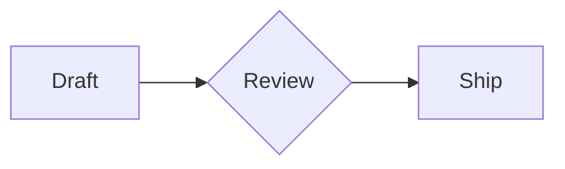

# Velocimd

Velocimd is a native Markdown editor built in Rust with `egui`. It is designed
around fast local editing, folder-based document switching, live preview, and a
small command surface that stays out of the way.

[](https://github.com/doesntdev/velocimd/actions/workflows/release.yml)

## Highlights

- Native desktop app for Linux, macOS, and Windows.
- Folder tabs: each tab represents a working folder, with Markdown files and
  child folders available from the tab menu.
- Markdown-only workflow with `.md` extensions hidden in the UI where possible.
- Split, editor-only, and preview-only modes.
- Debounced autosave with staged file replacement and failed-save draft recovery.
- Searchable command palette with keyboard navigation.
- Line-numbered editor with synchronized preview positioning.
- Native preview rendering with code highlighting, local images, and Mermaid
  flowchart support.
- Dark and light themes: `Velocidark` and `Velocilight`.
- Icon command bar with hover tooltips and keyboard shortcuts.
- Local app state persistence for open documents, recent files, folders, and
  theme selection.

## Status

Velocimd is early public software. It is usable for local Markdown editing, but
the file model, packaging, and preview behavior are still expected to evolve.
Use normal version-control habits for important notes.

## Quickstart

Download the latest packages from
[GitHub Releases](https://github.com/doesntdev/velocimd/releases/latest).

### macOS

Velocimd is not currently Developer ID signed or notarized. The command-line
installer downloads the latest DMG, verifies the GitHub release checksum,
installs `Velocimd.app` to `~/Applications`, and removes quarantine metadata:

```bash
curl -fsSL https://raw.githubusercontent.com/doesntdev/velocimd/main/scripts/install-macos.sh | bash
```

To install somewhere else:

```bash
curl -fsSL https://raw.githubusercontent.com/doesntdev/velocimd/main/scripts/install-macos.sh | VELOCIMD_INSTALL_DIR=/Applications bash
```

### Linux

Debian and Ubuntu users can download the `.deb` package from the latest release,
then install it with:

```bash
sudo apt install ./velocimd_*_amd64.deb
```

For other distributions, download the AppImage, make it executable, and run it:

```bash
chmod +x velocimd_*_x86_64.AppImage
./velocimd_*_x86_64.AppImage
```

### Windows

Download `velocimd_*_x64-setup.exe` from the latest release and run the
installer. Windows may show a SmartScreen warning while the installer is
unsigned.

### From Source

Install Rust stable, then run:

```bash
git clone https://github.com/doesntdev/velocimd.git
cd velocimd
cargo run --release
```

## Usage

On first launch, choose a working folder. New Markdown files are saved there by
default, and folder tabs let you switch between working directories. The `+`
command creates a new Markdown file in the active folder.

Open an existing Markdown file with `Ctrl+O`, or pass files on startup:

```bash
cargo run --release -- notes.md
```

Mermaid diagrams render directly in preview for fenced flowchart blocks:

````markdown

````

## Keyboard Shortcuts

| Shortcut | Action |
| --- | --- |
| `Ctrl+K` or `Ctrl+Shift+P` | Open command palette |
| `Ctrl+N` | Create a new Markdown file |
| `Ctrl+Shift+O` | Select working folder |
| `Ctrl+O` | Open Markdown file |
| `Ctrl+S` | Save current file |
| `Ctrl+Shift+S` | Save current file as |
| `Ctrl+W` | Close active folder tab |
| `Ctrl+1` | Editor mode |
| `Ctrl+2` | Preview mode |
| `Ctrl+3` | Split mode |
| `Ctrl+Tab` | Cycle editor / preview / split |
| `Alt+L` | Switch to Velocilight |
| `Alt+D` | Switch to Velocidark |

On macOS, egui maps command-style shortcuts to the platform command modifier.

The command palette supports case-insensitive/fuzzy search, Up/Down selection,
Enter to run a command, and Escape to dismiss. `Ctrl+W` closes a **folder tab**,
not a document; it leaves loaded documents intact and keeps the last folder open.

Save As refuses destinations already owned by another open document (including
symlink aliases). Failed writes retain dirty content in session recovery. If a
recovered draft differs from its on-disk file, it reopens as a pathless copy rather
than automatically overwriting the disk version. Save or rename that copy to
choose its destination.

## Development

Requirements:

- Rust stable
- Platform build dependencies required by `eframe`/`wgpu`

Common commands:

```bash
cargo check --locked
cargo test --locked
cargo clippy --all-targets --all-features
cargo run
```

Linux native smoke (isolated Xvfb display and temporary notes/config):

```bash
cargo build --locked
python3 scripts/native-smoke.py
```

Requires `Xvfb`, `xvfb-run`, `xdotool`, and ImageMagick. Results and screenshots
are written to the ignored `target/native-smoke/` directory. See
[stabilization notes](docs/stabilization.md) for coverage and remaining limitations.

The main app modules are:

- `src/ui.rs`: egui application shell and editor/preview layout.
- `src/app_state.rs`: documents, folder tabs, saving, recent files, and state
  persistence.
- `src/markdown.rs`: Markdown-to-HTML helper used by tests/export-style code.
- `src/mermaid.rs`: native Mermaid flowchart parsing and rendering.
- `src/theme.rs`: design tokens and theme application.

## Packaging

Velocimd uses `cargo-packager` with `Packager.toml`.

```bash
cargo install cargo-packager --locked
cargo packager --release
```

Package outputs are written to `dist/`.

The GitHub Actions release workflow builds packages on Linux, macOS, and Windows:

```bash
git tag v0.1.0
git push origin v0.1.0
```

The workflow can also be run manually from GitHub Actions.

## Privacy And Security

Velocimd is local-first. It does not require an account and does not send
document contents to a service. The app reads and writes files selected by the
user, plus its local config/state files under the operating system config
directory.

Current guardrails include:

- No `unsafe` code in the project.
- Markdown file opens are limited to regular UTF-8 files up to 16 MiB.
- Unreadable restored files are detached instead of overwritten on shutdown.
- The public HTML helper strips raw HTML and neutralizes dangerous URL schemes.
- Theme font sizes are clamped before being applied to the UI.

## License

Velocimd is released under the GNU Affero General Public License v3.0 only. See
`LICENSE` for the full license text.
