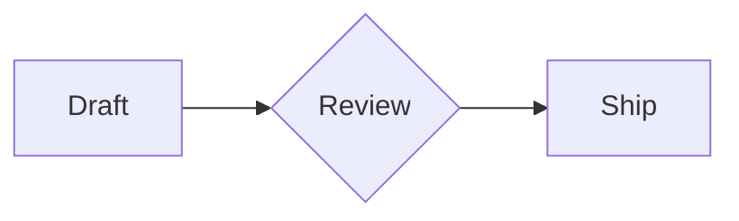

# Velocimd

Velocimd is a native Markdown editor built in Rust with `egui`. It is designed
around fast local editing, folder-based document switching, live preview, and a
small command surface that stays out of the way.

[](https://github.com/doesntdev/velocimd/actions/workflows/release.yml)

## Highlights

- Native desktop app for Linux, macOS, and Windows.
- Folder tabs: each tab represents a working folder, with Markdown files and
  child folders available from the tab menu.
- Markdown-only workflow with `.md` extensions hidden in the UI where possible.
- Split, editor-only, and preview-only modes.
- Streaming autosave for dirty documents.
- Line-numbered editor with synchronized preview positioning.
- Native preview rendering with code highlighting, local images, and Mermaid
  flowchart support.
- Zed-inspired dark and light themes: `Velocidark` and `Velocilight`.
- Icon command bar with hover tooltips and keyboard shortcuts.
- Local app state persistence for open documents, recent files, folders, and
  theme selection.

## Status

Velocimd is early public software. It is usable for local Markdown editing, but
the file model, packaging, and preview behavior are still expected to evolve.
Use normal version-control habits for important notes.

## Install

Prebuilt packages are produced by the release workflow when a `v*` tag is pushed.
Until release artifacts are published, build from source:

```bash
git clone https://github.com/doesntdev/velocimd.git
cd velocimd
cargo run --release
```

## Usage

On first launch, choose a working folder. New Markdown files are saved there by
default, and folder tabs let you switch between working directories. The `+`
command creates a new Markdown file in the active folder.

Open an existing Markdown file with `Ctrl+O`, or pass files on startup:

```bash
cargo run --release -- notes.md
```

Mermaid diagrams render directly in preview for fenced flowchart blocks:

````markdown

````

## Keyboard Shortcuts

| Shortcut | Action |
| --- | --- |
| `Ctrl+N` | Create a new Markdown file |
| `Ctrl+Shift+O` | Select working folder |
| `Ctrl+O` | Open Markdown file |
| `Ctrl+S` | Save current file |
| `Ctrl+Shift+S` | Save current file as |
| `Ctrl+W` | Close active folder tab |
| `Ctrl+1` | Editor mode |
| `Ctrl+2` | Preview mode |
| `Ctrl+3` | Split mode |
| `Ctrl+Tab` | Cycle editor / preview / split |
| `Alt+L` | Switch to Velocilight |
| `Alt+D` | Switch to Velocidark |

On macOS, egui maps command-style shortcuts to the platform command modifier.

## Development

Requirements:

- Rust stable
- Platform build dependencies required by `eframe`/`wgpu`

Common commands:

```bash
cargo check --locked
cargo test --locked
cargo clippy --all-targets --all-features
cargo run
```

The main app modules are:

- `src/ui.rs`: egui application shell and editor/preview layout.
- `src/app_state.rs`: documents, folder tabs, saving, recent files, and state
  persistence.
- `src/markdown.rs`: Markdown-to-HTML helper used by tests/export-style code.
- `src/mermaid.rs`: native Mermaid flowchart parsing and rendering.
- `src/theme.rs`: design tokens and theme application.

## Packaging

Velocimd uses `cargo-packager` with `Packager.toml`.

```bash
cargo install cargo-packager --locked
cargo packager --release
```

Package outputs are written to `dist/`.

The GitHub Actions release workflow builds packages on Linux, macOS, and Windows:

```bash
git tag v0.1.0
git push origin v0.1.0
```

The workflow can also be run manually from GitHub Actions.

## Privacy And Security

Velocimd is local-first. It does not require an account and does not send
document contents to a service. The app reads and writes files selected by the
user, plus its local config/state files under the operating system config
directory.

Current guardrails include:

- No `unsafe` code in the project.
- Markdown file opens are limited to regular UTF-8 files up to 16 MiB.
- Unreadable restored files are detached instead of overwritten on shutdown.
- The public HTML helper strips raw HTML and neutralizes dangerous URL schemes.
- Theme font sizes are clamped before being applied to the UI.

## License

Velocimd is released under the GNU Affero General Public License v3.0 only. See
`LICENSE` for the full license text.
