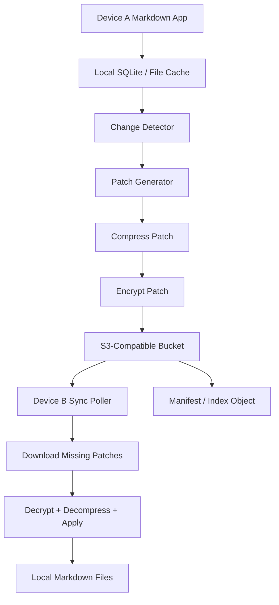
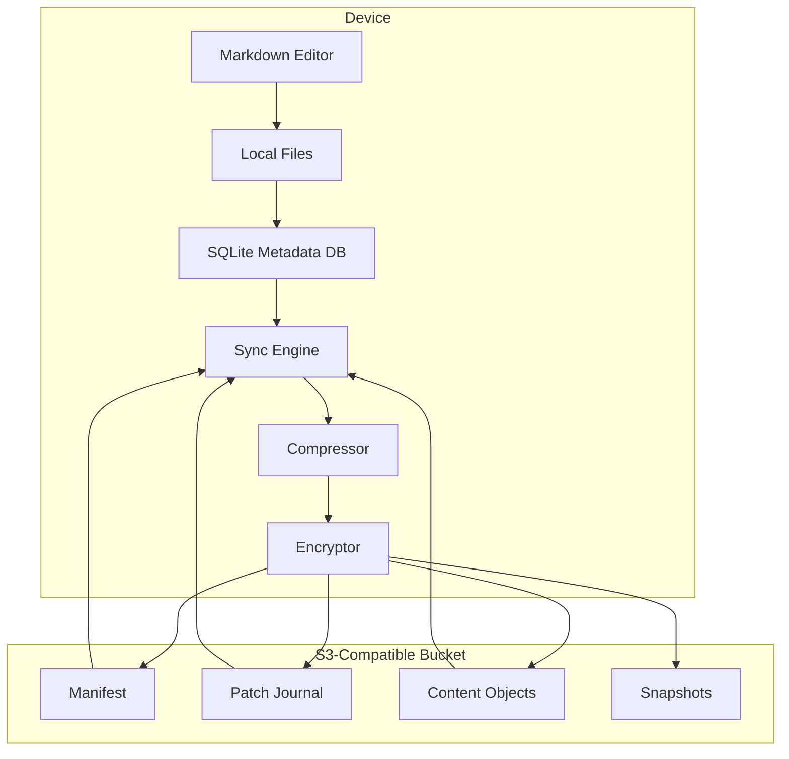

# Velocimd Version 1.1 Future Feature: Offline-First S3 Markdown Sync

## Status

Planned future feature for Velocimd 1.1.

This is not an MVP requirement. Version 1.1 should explore a genuinely differentiated sync layer for Markdown-only workspaces: content-addressed, compressed, encrypted, append-only synchronization through S3-compatible object storage.

## One-sentence concept

Build it like Git for Markdown, but instead of pushing to a Git remote, push compressed, encrypted, content-addressed patches and manifests to S3-compatible object storage.

## Product rationale

Velocimd only reads and writes Markdown. That constraint is powerful. Markdown is plain text, compresses extremely well, can be diffed line-by-line, and maps naturally to append-only change history.

Rather than syncing files as files, Velocimd 1.1 can treat the user workspace as a content-addressed Markdown object graph:

- local Markdown files remain the user-facing source
- local SQLite tracks metadata, hashes, device state, and applied changes
- compressed patch journals capture edits
- content chunks are deduplicated by hash
- S3-compatible storage acts as a dumb rendezvous point, not the source of truth

The result would be Dropbox-like sync without running a server.

## Core architecture

Do not sync files directly.

Sync:

1. content chunks
2. file manifests
3. append-only patches
4. occasional snapshots
5. device heads

Example conceptual remote layout:

```text
/user/{userId}/workspaces/{workspaceId}/
  manifest.json
  devices/
    laptop.json
    phone.json
  objects/
    aa/bb/<sha256>.zst
  patches/
    2026/04/28/<timestamp>-<deviceId>-<changeId>.patch.zst
  snapshots/
    <snapshotId>.tar.zst
```

Alternative internal layout:

```text
workspace/
  objects/
    ab/cd/<hash>.zst
    12/34/<hash>.zst
  manifests/
    latest.json
    <device-id>-head.json
  journal/
    2026-04-28T20-15-22Z-<device-id>.patch.zst
```

## Local source of truth

S3 should not be the canonical database.

The source of truth should be:

```text
local SQLite + local Markdown files + append-only sync journal
```

S3-compatible storage is only the rendezvous point for other devices.

This gives Velocimd:

- offline-first behavior
- cheap sync
- no always-on backend requirement
- easy backups
- low lock-in
- strong recovery story
- portable workspaces
- integrity verification

## Local SQLite model

Each device should maintain a local database for workspace metadata.

Suggested tables:

### files

- `path`
- `current_hash`
- `last_modified`
- `version_vector`

### objects

- `hash`
- `local_path`
- `remote_key`
- `compression`
- `size`

### changes

- `change_id`
- `file_path`
- `base_hash`
- `result_hash`
- `device_id`
- `timestamp`
- `applied`

## Content-addressed storage

Every file version gets a content hash:

```text
sha256(markdown_content) = file_hash
```

Every chunk gets a content hash:

```text
sha256(chunk_content) = chunk_hash
```

Chunks are compressed and uploaded once. Devices only upload or download missing chunks.

Example manifest entry:

```json
{
  "path": "notes/agent-hq.md",
  "hash": "sha256:abcdef...",
  "chunks": [
    "sha256:111...",
    "sha256:222...",
    "sha256:333..."
  ],
  "updatedAt": "2026-04-28T20:20:00Z",
  "deviceId": "phone"
}
```

Sync flow:

1. Pull latest manifest.
2. Compare local and remote hashes.
3. Download only missing chunks.
4. Reassemble Markdown.
5. Update the local cache and SQLite metadata.

## Patch journal

Velocimd should maintain an append-only patch stream for efficient sync.

Example journal layout:

```text
journal/
  000001-laptop.patch.zst
  000002-phone.patch.zst
  000003-tablet.patch.zst
```

Example patch metadata:

```json
{
  "op": "replace",
  "path": "notes/foo.md",
  "baseHash": "sha256:abc",
  "newHash": "sha256:def",
  "diff": "<compressed unified diff or binary patch>"
}
```

A device syncs by asking:

> What journal entries have I not applied?

Then it downloads, verifies, decrypts, decompresses, and applies only those entries.

## Change packet example

A Markdown note update might be represented as:

```json
{
  "path": "projects/sync.md",
  "base": "sha256:old-file-hash",
  "patch": "sha256:compressed-patch-hash",
  "new": "sha256:new-file-hash",
  "device": "laptop-01",
  "timestamp": "2026-04-28T20:15:22Z"
}
```

The patch itself can be one of:

- compressed unified diff
- binary delta
- JSON Patch
- diff-match-patch payload
- future CRDT operation log

## Practical buildable design

Recommended first implementation for 1.1:


## End-to-end sync architecture



High-end architecture:



## Recommended technology choices

| Concern | Recommendation |
| --- | --- |
| Storage | S3, Cloudflare R2, Backblaze B2, MinIO |
| Compression | Zstandard |
| Local DB | SQLite |
| File watching | Native watcher per platform |
| Patch format | Unified diff first, then consider diff-match-patch |
| Conflict strategy | Git-style 3-way merge |
| Auth | User-owned bucket credentials first; app-managed presigned URLs later |
| Encryption | Encrypt before upload |
| Manifest | Small JSON object per workspace |
| Sync model | Pull manifest, push changes, reconcile |

## Conflict strategy

Conflict handling is the hard part.

### Option 1: Last writer wins

Simple, but dangerous.

Scenario:

1. Phone edits note offline.
2. Laptop edits same note offline.
3. Whichever device syncs last wins.

This is acceptable for an early prototype, but bad for user trust.

### Option 2: Git-style merge

Best middle ground for Velocimd 1.1.

Markdown is line-oriented enough that Git-style 3-way merge is viable. If two devices edit different sections, merge automatically. If they touch the same lines, create conflict markers:

```text
<<<<<<< laptop
My version
=======
Phone version
>>>>>>> phone
```

This is understandable to technical users and preserves data instead of silently destroying it.

### Option 3: CRDT

Most elegant, most complex.

CRDTs such as Automerge-style or Yjs-style operation logs could support true multi-device offline collaboration. For a solo-user Markdown app, this is probably overkill for 1.1 unless real-time editing becomes a product goal.

## Security model

For 1.1, assume object storage is not trusted.

Requirements:

- encrypt before upload
- never upload plaintext Markdown unless user explicitly disables encryption
- authenticate manifests and patches
- verify content hashes after download
- reject hash mismatches
- support local recovery from snapshots and journal replay

Open questions:

- key derivation and storage
- device enrollment flow
- recovery key UX
- whether workspace sharing is in scope

## Killer feature

Every Markdown workspace becomes portable and self-healing.

Because everything is content-addressed, Velocimd can eventually support:

- export workspace
- verify integrity
- restore any version
- sync across devices
- deduplicate notes
- encrypt everything
- run without a backend
- back up to any S3-compatible provider

This is a strong architecture for:

- personal knowledge bases
- developer notes
- AI memory layers
- local-first writing systems

## Non-goals for Version 1.1

Keep the first sync release disciplined.

Do not attempt all of this at once:

- real-time collaborative editing
- CRDT-based editing
- team workspaces
- hosted Velocimd accounts
- plugin sync APIs
- mobile sync clients
- conflict-free rich-text editing

Version 1.1 should focus on solo-user, offline-first, encrypted Markdown sync.

## Version 1.1 acceptance criteria

A plausible Version 1.1 sync release should satisfy:

- User can configure an S3-compatible bucket for one workspace.
- Velocimd creates and maintains local SQLite sync metadata.
- Velocimd computes content hashes for Markdown files.
- Velocimd uploads compressed, encrypted patches or chunks.
- A second device can pull and apply missing changes.
- Conflicting edits are detected and never silently overwritten.
- Git-style conflict markers are produced for unmergeable conflicts.
- User can verify workspace integrity.
- User can restore from at least one snapshot.
- Sync can run without a Velocimd-hosted backend.

## Implementation notes

Suggested phased implementation:

1. Add local SQLite metadata for files, hashes, devices, and changes.
2. Add content normalization and SHA-256 hashing.
3. Add zstd compression.
4. Add local append-only patch journal.
5. Add workspace manifest generation.
6. Add S3-compatible upload/download adapter.
7. Add encryption layer before upload.
8. Add remote manifest polling.
9. Add 3-way merge for line-based Markdown conflicts.
10. Add snapshot export and restore.
11. Add integrity verification command.

## Bottom line

This feature would make Velocimd more than a fast Markdown editor. It would make it a local-first Markdown workspace with cheap, portable, serverless sync.

The design should stay boring at the infrastructure layer and clever at the data model layer:

```text
local-first files + SQLite metadata + append-only encrypted patches + content-addressed S3 objects
```
